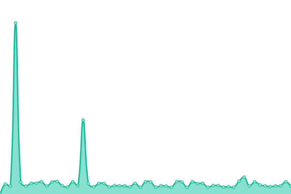

# [📈 Live Status](https://durof.github.io/status): <!--live status--> **🟧 Partial outage**

This repository contains the open-source uptime monitor and status page for [durof](https://durof.github.io/status), powered by [Upptime](https://github.com/upptime/upptime).

With [Upptime](https://upptime.js.org), you can get your own unlimited and free uptime monitor and status page, powered entirely by a GitHub repository. We use [Issues](https://github.com/durof/status/issues) as incident reports, [Actions](https://github.com/durof/status/actions) as uptime monitors, and [Pages](https://durof.github.io/status) for the status page.

<!--start: status pages-->
<!-- This summary is generated by Upptime (https://github.com/upptime/upptime) -->
<!-- Do not edit this manually, your changes will be overwritten -->
<!-- prettier-ignore -->
| URL | Status | History | Response Time | Uptime |
| --- | ------ | ------- | ------------- | ------ |
|  [devs.today](https://devs.today) | 🟩 Up | [devs-today.yml](https://github.com/durof/status/commits/HEAD/history/devs-today.yml) | 

 575ms
     
 | 

<a href="https://durof.github.io/status/history/devs-today">100.00%</a>
    

|  [Instant View Generation (@rreadbot)](https://a.devs.today/example.org) | 🟩 Up | [instant-view-generation-rreadbot.yml](https://github.com/durof/status/commits/HEAD/history/instant-view-generation-rreadbot.yml) | 

 991ms
     
 | 

<a href="https://durof.github.io/status/history/instant-view-generation-rreadbot">100.00%</a>
    

|  [Inline Search Bot](https://backend.isbotdown.com/bots/isbot) | 🟩 Up | [inline-search-bot.yml](https://github.com/durof/status/commits/HEAD/history/inline-search-bot.yml) | 

 486ms
     
 | 

<a href="https://durof.github.io/status/history/inline-search-bot">100.00%</a>
    

|  [Mention Bot](https://backend.isbotdown.com/bots/mentionbot) | 🟩 Up | [mention-bot.yml](https://github.com/durof/status/commits/HEAD/history/mention-bot.yml) | 

 162ms
     
 | 

<a href="https://durof.github.io/status/history/mention-bot">85.55%</a>
    

|  [Mention Robot](https://backend.isbotdown.com/bots/mentionrobot) | 🟩 Up | [mention-robot.yml](https://github.com/durof/status/commits/HEAD/history/mention-robot.yml) | 

 143ms
     
 | 

<a href="https://durof.github.io/status/history/mention-robot">77.26%</a>
    

|  [Mention Mirror Bot](https://backend.isbotdown.com/bots/mentionmirrorbot) | 🟩 Up | [mention-mirror-bot.yml](https://github.com/durof/status/commits/HEAD/history/mention-mirror-bot.yml) | 

 146ms
     
 | 

<a href="https://durof.github.io/status/history/mention-mirror-bot">92.61%</a>
    

|  [Mention Test Bot](https://backend.isbotdown.com/bots/mentiontestbot) | 🟩 Up | [mention-test-bot.yml](https://github.com/durof/status/commits/HEAD/history/mention-test-bot.yml) | 

 134ms
     
 | 

<a href="https://durof.github.io/status/history/mention-test-bot">100.00%</a>
    

|  [Instant Read Bot](https://backend.isbotdown.com/bots/rreadbot) | 🟩 Up | [instant-read-bot.yml](https://github.com/durof/status/commits/HEAD/history/instant-read-bot.yml) | 

 176ms
     
 | 

<a href="https://durof.github.io/status/history/instant-read-bot">0.00%</a>
    

|  [Gen Face Bot](https://backend.isbotdown.com/bots/genfacebot) | 🟥 Down | [gen-face-bot.yml](https://github.com/durof/status/commits/HEAD/history/gen-face-bot.yml) | 

 150ms
     
 | 

<a href="https://durof.github.io/status/history/gen-face-bot">0.00%</a>
    

|  TEST A | 🟥 Down | [test-a.yml](https://github.com/durof/status/commits/HEAD/history/test-a.yml) | 

 0ms
     
 | 

<a href="https://durof.github.io/status/history/test-a">0.00%</a>
    

<!--end: status pages-->

[**Visit our status website →**](https://durof.github.io/status)

## 📄 License

- Powered by: [Upptime](https://github.com/upptime/upptime)
- Code: [MIT](./LICENSE) © [durof](https://durof.github.io/status)
- Data in the `./history` directory: [Open Database License](https://opendatacommons.org/licenses/odbl/1-0/)
